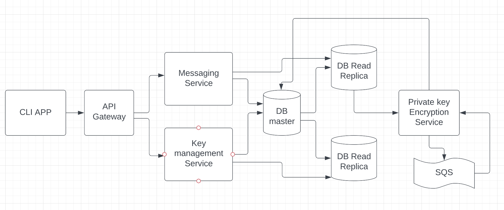

### Secret Management Service

# Overview

The user interacts with the services using CLI.

The request goes through the API Gateway to the required microservices.

We can have various auth related features implemented here.

Like username password validation, session validation etc.

The requests and responses will be passed over the https protocol.

The users will first fetch a session token from the backend which will be sent to them, every consecutive requests will have the token in the headers.

All the read only requests can go to <strong>Read Replicas</strong> of the database.

We can later split this architecture into complete microservices based architecture with separate databases, currently this is a simple service oriented architecture.

# Services

### Key management Service

The users can use this service to create their public private key pairs,
that are stored in the database.

The private key is <strong>encrypted</strong> using a key which can be stored in the env variable, a better practice would be to store it using some 3rd party services like hashicorp or in amazon parameter store.

The secret key which is used to encrypt the private keys of the user is changed at regular intervals, for this we can push all the private keys we have got registered with us and which are in regular use to a sqs queue based service, encrypt them again with the new secret key and save them to db.

### Messages service

This service can be used to send message from user1 to user2. The users will use the CLI, to send the message, which will reach the backend, will get encrypted using public key of the receiver and stored in the database.

When the user fetches his messages, the messages will be decrypted using the users private keys and sent as a response to the requester.

### Private key encryption service

The private keys of the users are stored with us in a database. A good practice would be to rotate their private keys but that can be a cumbersome process where we will have to reEncrypt all the messages of the user hence we can instead store their private keys in the database but in encrypted form, for that we are having this service.

Instead of reencrypting all the messages, a better way would be to reencrypt all the private keys, those which are not encrypted will be pushed into the queue after a predefined interval, they will be reencrypted and saved back into the database.

SQS provides resiliency, and we can have multiple workers pulling the keys from SQS and reencrypting them and saving them back to database.

SQS handles deduplication, retries for us and the keys read are in flight mode so we can be sure that the same keys wont be picked up by 2 different workers.

Also this can be scaled as demand grows, more workers/machines for handling reencryption of multiple keys.

## Note on Resiliency

We can have an event driven approach for the whole architecture.

One can have a request and response queue for each and every microservice.

Whenever a microservice needs to interact with another, it can simply send the message to the request queue.
And the response will be sent to the response queue of the same microservice.

This design guarantees resiliency, idempotency and atleasy once delivery (all inherent features of the queue).

## Other services

We can have an `auth service` after the gateway, this way the gateway will just handle some of the features like retries etc and we can decouple the auth service into a separate auth service (kind of a middleware).

